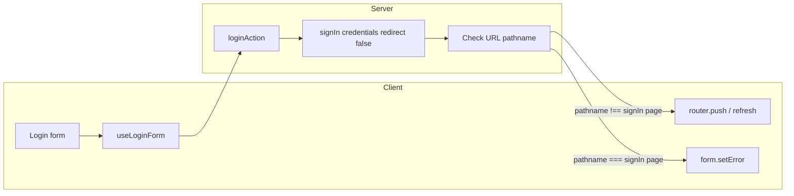
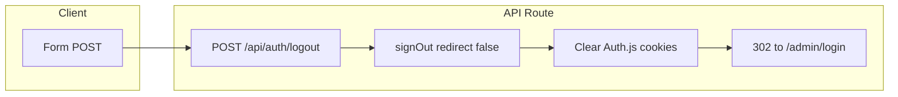

# Authentication and Logout Guidelines (AI Agent)

## Document Version: 1.2

**Creation Date:** February 2026  
**Project:** plumb_sm  
**Technologies:** NextAuth v5 (Auth.js), Credentials provider, JWT, Next.js App Router, Server Actions, Route Handlers

---

## 1. Overview

This document describes how authentication (login with credentials) and logout are implemented in the project. Use it when adding or changing auth flows, protecting routes, or debugging sign-in/sign-out behavior. The pattern follows Next.js best practices: Server Actions for form-submit mutations, Route Handlers where redirects and cookie clearing are needed.

**Documentation:** When implementing or changing auth, **use Context7** to retrieve the latest Auth.js / NextAuth v5 documentation (signIn return value, signOut options, Credentials provider, callbacks). Do not rely only on in-repo comments or this guideline for API behavior.

**Stack:**

- NextAuth v5 (Auth.js), Credentials provider, JWT strategy
- Next.js App Router, Server Components by default
- Server Action for login (no redirect from action; client handles navigation)
- Route Handler for logout (signOut + explicit cookie clearing + redirect)

---

## 2. Login Flow

### 2.1. Server Action

Implemented in `src/actions/auth.ts`.

- **Call:** `signIn("credentials", { email, password, redirectTo: callbackUrl, redirect: false })`. You must pass **redirectTo**, not `callbackUrl`: in next-auth the post-login redirect URL is taken from the `redirectTo` option; if it is missing, Referer (the login page) or `"/"` is used, so a successful login is wrongly sent to the login page and treated as failure.
- **Return value** from NextAuth when `redirect: false`: a **string** — the redirect URL (not an object `{ ok, error, url }`). Check Context7 (Auth.js / next-auth) for current behavior.
  - Success: the URL points to the given `redirectTo` (e.g. `/admin/dashboard`).
  - Failure: the URL points to the sign-in page (`pages.signIn`, e.g. `/admin/login`), often with `?error=...` in the query.
- **Logic:** treat `result` as a string; parse it as a URL. If it is not a string or parsing fails → `{ ok: false, error: "Login failed. Please try again." }`. If pathname is the sign-in page → read the `error` query param and map it to a user-facing message (see below); otherwise → `{ ok: true, url: result }`.
- **Error messages:** when pathname is the sign-in page, read `parsedUrl.searchParams.get("error")` and map to user messages (e.g. `getLoginErrorMessage`): `Configuration` → "Server configuration error. Please try again later."; `AccessDenied` → "Access denied. Your account may not be allowed to sign in."; `Verification` → "Verification failed. The link may have expired."; `CredentialsSignin`, `Callback`, or no code → "Invalid email or password. Please try again." (do not reveal which credential failed, for security).
- **Contract:** `LoginResult` = `{ ok: true, url: string }` | `{ ok: false, error: string, url?: string }`. The client uses it to decide: navigate or show form error.

Example logic (pathname + error param):

```ts
const result = await signIn("credentials", {
  email,
  password,
  redirectTo: callbackUrl,  // use redirectTo, not callbackUrl in options
  redirect: false,
});
if (typeof result !== "string" || !result.trim()) {
  return { ok: false, error: "Login failed. Please try again." };
}
let parsedUrl: URL;
try {
  parsedUrl = new URL(result, "http://localhost");
} catch {
  return { ok: false, error: "Login failed. Please try again." };
}
const pathname = parsedUrl.pathname;
const isSignInPage = pathname === ADMIN_LOGIN || pathname.endsWith("/admin/login");
if (isSignInPage) {
  const errorCode = parsedUrl.searchParams.get("error") ?? undefined;
  const errorMessage = getLoginErrorMessage(errorCode);  // maps Configuration, AccessDenied, Verification, CredentialsSignin/Callback/default
  return { ok: false, error: errorMessage, url: result };
}
return { ok: true, url: result };
```

### 2.2. Client (form / hook)

Implemented in `src/hooks/use-login-form.ts`.

- Call `loginAction(email, password, callbackUrl)`. When `result.ok === true`: `router.push(result.url)` and `router.refresh()`. On failure: `form.setError("root", { message: result.error })`.

### 2.3. Validation and authorize

- **Validation:** shared Zod schema in `src/lib/validation/auth`; used by the login form and the Credentials provider.
- **Authorize:** in `src/lib/auth/auth.config.ts`, in the Credentials provider’s `authorize` callback — same schema, user lookup via Prisma, password check via bcrypt. Return `null` on invalid input or error.

### 2.4. Login flow diagram



---

## 3. Logout Flow

### 3.1. Route Handler

Implemented in `src/app/api/auth/logout/route.ts`, method `POST`.

- Call `signOut({ redirect: false })`.
- Explicitly clear Auth.js cookies (session, csrf-token, callback-url; both plain and secure variants) so logout is reliable.
- Response: `302` redirect to `/admin/login`.

### 3.2. Invocation from admin UI

Implemented in the admin sidebar component (e.g. `src/components/admin/AdminSidebar/AdminSidebar.tsx`).

- Form with `action="/api/auth/logout"` and `method="POST"` — browser sends POST without client-side fetch (progressive enhancement).

### 3.3. Logout flow diagram



---

## 4. Auth configuration (auth.config.ts)

Auth.js config is defined in `src/lib/auth/auth.config.ts` and passed to `NextAuth(authConfig)` in `src/lib/auth/auth.ts`; that module exports `handlers`, `auth`, `signIn`, `signOut`.

**Fields overview:**

- **secret** — `AUTH_SECRET` from env; **trustHost** — trust the host (required for some flows).
- **providers** — one Credentials provider with `email` and `password`; in `authorize`: validate with the shared Zod schema (`loginSchema`), look up user by email (Prisma), compare password with `bcrypt.compare`; on success return the user object (`id`, `name`, `email`, `image`, `role`), on error or invalid data return `null`.
- **callbacks.jwt** — on sign-in, write `id` and `role` from `user` into the token.
- **callbacks.session** — set `id` and `role` on `session.user` from the token.
- **pages.signIn**, **pages.error** — both point to `/admin/login`; on auth failure, redirect to this page (the Server Action treats this pathname in the returned URL as failure).
- **session.strategy** — `"jwt"`; **maxAge** and **updateAge** set session lifetime and refresh interval (e.g. 30 days and 24 hours).

Example structure (no full code):

```ts
const authConfig: NextAuthConfig = {
  secret: process.env.AUTH_SECRET,
  trustHost: true,
  providers: [
    Credentials({
      credentials: { email: { ... }, password: { ... } },
      async authorize(credentials) {
        // loginSchema.safeParse(credentials) → Prisma findUnique → bcrypt.compare
        // return user object or null
      },
    }),
  ],
  callbacks: {
    async jwt({ token, user }) { /* token.id, token.role from user */ return token; },
    async session({ session, token }) { /* session.user.id, session.user.role from token */ return session; },
  },
  pages: { signIn: "/admin/login", error: "/admin/login" },
  session: { strategy: "jwt", maxAge: ..., updateAge: ... },
};
```

---

## 5. Security

- Passwords only as hashes (bcrypt); do not log or send to the client.
- Validate input on the server (Zod in the action and in `authorize`).
- Secrets and credentials only on the server (`AUTH_SECRET`, DB).

---

## 6. Summary

| Area     | Implementation |
| -------- | -------------- |
| Login    | Server Action in `src/actions/auth.ts` → `signIn(..., { redirectTo: callbackUrl, redirect: false })`; interpret returned URL string (pathname + query `error`) into `LoginResult`, map error codes to messages (`getLoginErrorMessage`); client in `use-login-form.ts` uses `result.ok` to `router.push` or `form.setError`. |
| Logout   | Route Handler in `src/app/api/auth/logout/route.ts` → `signOut({ redirect: false })` + clear Auth.js cookies + 302 to `/admin/login`. Invoked via form with `action` and `method="POST"`. |
| Config   | `src/lib/auth/auth.config.ts`: Credentials, authorize (Prisma + bcrypt), callbacks jwt/session, pages.signIn/error, session.strategy "jwt". |
| Security | bcrypt, server-side validation, no secrets on the client. |

When implementing or changing auth: use **Context7** for up-to-date Auth.js/NextAuth docs; pass **redirectTo** (not `callbackUrl`) to `signIn` for correct post-login redirect; keep the sign-in path (`/admin/login`) in sync between config and the Server Action URL check.
