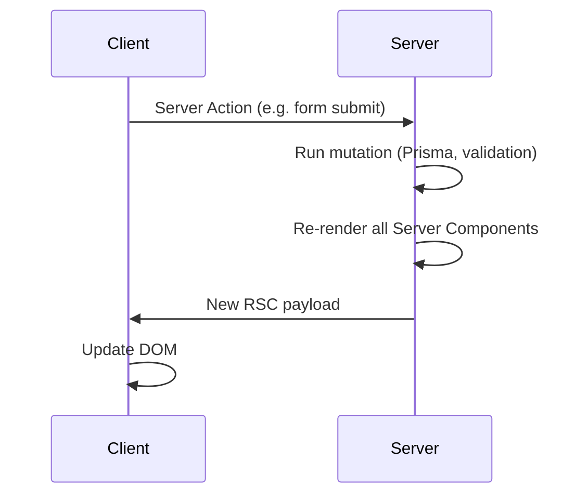
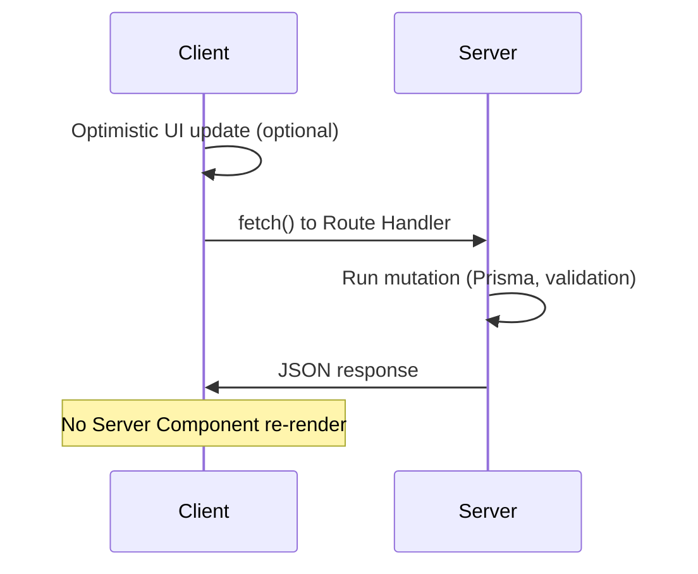

# Next.js Data Access: Server Actions vs API Routes

## Document Version: 1.0

**Creation Date:** February 2026  
**Project:** neon_bpl (Plumbing website)  
**Technologies:** Next.js 16 (App Router), React 19, Prisma, Neon PostgreSQL

This document is the **source of truth** for when to use Server Actions vs API Routes (Route Handlers) for reading and mutating application data. AI agents MUST follow this guideline when implementing data access or mutations.

---

## 1. Why This Document

In the Next.js App Router there are two ways to run a server-side mutation from a client component:

1. **Server Action** — a server function with the `'use server'` directive, called directly from client code.
2. **API Route (Route Handler)** — an HTTP endpoint (`app/api/.../route.ts`) called via `fetch()`.

Both run code on the server. They differ in **what happens to the UI after the call**. Choosing the wrong option can cause unnecessary full-page re-renders, slow response, and poor UX or performance.

---

## 2. Key Difference: Automatic Re-render

### Server Action: Re-renders the Page

When a client component calls a Server Action:

1. Next.js sends a POST request to the server.
2. The Server Action runs (mutation, validation, business logic).
3. **After it finishes**, Next.js **automatically re-renders all Server Components on the current page**.
4. A new RSC payload is sent to the client and applied to the DOM.

Step 3 is built into the App Router. It **cannot be disabled**. It happens every time, even if the Server Action does not call `revalidatePath` or `revalidateTag`.



### API Route: Does Not Re-render the Page

When a client component calls an API Route via `fetch()`:

1. The browser sends an HTTP request (PATCH, POST, etc.) to `/api/...`.
2. The Route Handler runs the mutation.
3. It returns a JSON response.
4. **The page does not re-render** — React is not aware of the request; Server Components are not re-run.



---

## 3. When to Use What

### 3.1 Use Server Action When

- **Form submit** — User fills a form and clicks "Save". After save they expect to see updated data (e.g. list, detail).
- **Modal close that should refresh data** — After closing a modal (e.g. edit dialog), the parent list or table should reflect the change.
- **Navigation after mutation** — After creating an entity, redirect to a new page or refresh the current view.
- **Progressive enhancement** — The form should work without JavaScript (submit to Server Action).

**Examples:** Create/edit service form, order form, modal that updates a list on close, "Save and go to list" flows.

### 3.2 Use API Route When

- **Inline editing with optimistic UI** — The client has already updated local state; a full server re-render is unnecessary and can be slow.
- **Rapid successive mutations** — User clicks many cells or fields in a row (e.g. table of scores, checkboxes). Each Server Action would trigger a full re-render and many DB/cache calls.
- **Heavy Server Components on the page** — A full re-render would re-run many Server Component trees and data fetches; an API Route avoids that.

**Examples:** Inline-edit cell in a table, bulk toggle checkboxes, quick status updates where the client already shows the new state.

---

## 4. Shared Logic

Server Actions and Route Handlers MUST **share** the same business and data layer. Do not duplicate mutation logic.

- **Validation:** Use the same Zod schemas (e.g. in `lib/validation/`).
- **Data access:** Use the same Prisma calls or helpers (e.g. in `lib/db/` or inside `actions/`).
- **Auth:** Both must check authorization (e.g. `auth()` from Auth.js) before performing protected mutations.

Example layout:

```
src/
├── actions/
│   └── services.ts              # Server Actions (forms, modals)
├── app/api/
│   └── service-status/
│       └── route.ts              # Route Handler (inline status update)
├── lib/
│   ├── db/                       # Shared Prisma / queries
│   └── validation/               # Shared Zod schemas
```

---

## 5. revalidatePath and revalidateTag

- **Server Actions:** Call `revalidatePath('/path')` or `revalidateTag('tag')` when you want the next navigation or refresh to see fresh data. This invalidates Next.js caches; the automatic re-render after the action will then use up-to-date data.
- **API Routes:** The client typically updates its own state (e.g. optimistic UI). No automatic re-render occurs. If the user later navigates away and back, or refreshes, the page will fetch again; you can still use `revalidatePath`/`revalidateTag` in other flows (e.g. a Server Action that runs on the next form submit) to keep cache consistent.

---

## 6. File Layout (Recommendation)

| Location                             | Purpose                                                                                            |
| ------------------------------------ | -------------------------------------------------------------------------------------------------- |
| `src/actions/`                       | Server Actions for forms, modals, and any flow that benefits from a full re-render after mutation. |
| `src/app/api/.../route.ts`           | Route Handlers for inline edit, high-frequency mutations, or when re-render would be expensive.    |
| `src/lib/db/`, `src/lib/validation/` | Shared by both; no duplication of mutation or validation logic.                                    |

---

## 7. Checklist for AI Agent

Before implementing a mutation, apply this decision flow:

1. **Is it a form submit, modal-close refresh, or navigation-after-mutation?**  
   → Prefer **Server Action**.

2. **Is it inline editing or rapid successive updates with optimistic UI (or would a full re-render be expensive)?**  
   → Prefer **API Route** (Route Handler).

3. **Shared layer:** Reuse the same validation (Zod) and data access (Prisma) in both Server Actions and Route Handlers; do not duplicate business logic.

4. **Auth:** Always check authorization (e.g. `auth()`) in both Server Actions and Route Handlers before performing protected operations.

---

## 8. Related Documentation

- [Auth & Data Management](../../architecture/auth_data_management.md) — Section 5: Data Fetching Patterns and general rule that application data is read/mutated only via Server Components, Server Actions, or API Routes as specified here.
- [Next.js Loading Patterns](./ai_loading_patterns.md) — Loading and streaming patterns for pages.
- [Agent Execution Rules](../../implementation/agent_execution_rules.md) — States that this guideline takes priority over the reference project `docs/examples/my_site` for Server Actions vs API Routes decisions.
- [Workflow Rules](../../.cursor/rules/workflowrule.mdc) — Same priority rule for data access and mutation patterns.

---

**Last Updated:** February 2026  
**Applies To:** AI Agent (Cursor AI) for neon_bpl project
