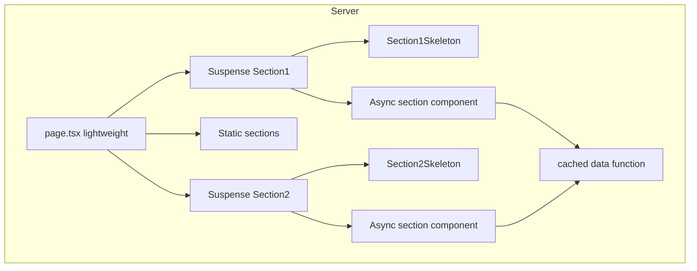

# Next.js Public Pages Optimization Guideline

## Document Version: 1.0

**Creation Date:** February 2026  
**Project:** neon_bpl (Plumbing website)  
**Technologies:** Next.js 16 (App Router), React 19, Prisma, TypeScript

This document defines the **standard approach** for optimizing public pages that have multiple sections and data fetches. It ensures fast first response (TTFB/FCP) without harming SEO by using streaming per section, cached shared data, section skeletons, and page metadata. Use this guideline when creating or refactoring any public route in the project.

> [!NOTE]
> When implementing, verify against the latest [Next.js Loading UI and Streaming](https://nextjs.org/docs/app/building-your-application/routing/loading-ui-and-streaming) documentation.

---

## 1. Overview

Public pages (e.g. homepage, landing pages, service index) often consist of several sections: some fetch data from the database, others are static. If the page waits for all async work before sending HTML, the first byte is delayed and the user sees nothing until the slowest request completes.

**Goal:** Send the first RSC chunk quickly (layout + static content + skeleton placeholders), then stream each async section as its data is ready. Crawlers still receive full HTML; SEO is preserved.

**Reference implementation:** The homepage in [src/app/(public)/page.tsx](<src/app/(public)/page.tsx>) and the section components/skeletons in [src/components/landing/](src/components/landing/) follow this approach and serve as the project template.

---

## 2. Key Principles

| Principle                                      | Description                                                                                                                                                                                                                                                                             |
| ---------------------------------------------- | --------------------------------------------------------------------------------------------------------------------------------------------------------------------------------------------------------------------------------------------------------------------------------------- |
| **Lightweight page.tsx**                       | Page component only composes layout and Suspense wrappers. No heavy `await` in the page root; all data loading happens inside section components.                                                                                                                                       |
| **Suspense per async section**                 | Every section that performs a DB (or API) fetch is wrapped in `<Suspense fallback={<SectionSkeleton />}>`. Each has its own fallback so the server can stream sections independently.                                                                                                   |
| **Deduplicate shared data**                    | If two or more sections need the same data (e.g. list of services), move the fetch into a single function wrapped with React `cache()` in a lib/data module. Sections call that function and slice/filter as needed; only one request runs per render.                                  |
| **Section skeletons**                          | Each async section has a dedicated skeleton component that mirrors its layout. The same skeleton is used as the Suspense fallback and in the route's `loading.tsx` so markup is not duplicated.                                                                                         |
| **Metadata per page**                          | Every public page exports `metadata` (or uses `generateMetadata`) with at least `title`, `description`, and `openGraph` for SEO and social previews.                                                                                                                                    |
| **Optional: dynamic for below-fold client UI** | For interactive below-the-fold components (accordion, tabs, etc.), use `next/dynamic` with `ssr: true` so HTML is still rendered for crawlers while the client bundle can load after first paint.                                                                                       |
| **LCP: hero image priority**                   | For pages where a large hero image is the LCP element, use `priority` and `fetchPriority="high"` on that Image. For index/grid pages, give the first visible card image loading priority via an optional `priority` prop (e.g. `priority={categoryIndex === 0 && serviceIndex === 0}`). |

---

## 3. Architecture



- **First RSC chunk:** Layout + lightweight page + static sections + skeleton fallbacks. No need to wait for any DB call.
- **Later chunks:** Each async section resolves and replaces its fallback when its data is ready.
- **Crawlers:** Final HTML contains all sections; streaming does not hide content from SEO.

---

## 4. Checklist for a New Public Page

When adding or refactoring a public page with multiple sections:

1. **Identify async vs static sections** — Which sections call Prisma or fetch? Which are pure static (constants, config)?
2. **Shared data** — If several sections need the same dataset, create a `cache()`-wrapped fetcher in `src/lib/...` or `src/data/...`. Sections call it and derive what they need (e.g. full list for dropdown, `.slice(0, n)` for a grid).
3. **Section skeletons** — For each async section, add a skeleton component (e.g. `SectionSkeleton.tsx`) next to the section; export it from the section's index. Match structure and use `aria-label` for loading state.
4. **page.tsx** — Import only sections and skeletons; export `metadata`. Wrap each async section in `<Suspense fallback={<SectionSkeleton />}><Section /></Suspense>`. Do not wrap static sections.
5. **loading.tsx** — Reuse the same section skeletons (and a minimal CTA/static block if needed) so route-level loading matches the streaming fallbacks and markup is not duplicated.
6. **Metadata** — Set `title`, `description`, and `openGraph` (title, description, type: 'website') for the page.
7. **Optional** — For below-the-fold client-only interactivity (e.g. accordion), load the component with `next/dynamic(..., { ssr: true })` so content stays in the initial HTML.
8. **LCP (hero)** — If the page has a large above-the-fold hero image that is the LCP candidate, set `priority` (and `fetchPriority="high"` if the Image atom supports it) on that image.

---

## 5. Code Examples

### 5.1 Page structure (metadata + Suspense)

```typescript
// page.tsx — lightweight: no await in root
import type { Metadata } from 'next';
import { Suspense } from 'react';
import { SITE } from '@/config/site';
import { Hero, HeroSkeleton } from '@/components/landing/Hero';
import { ServicesPreview, ServicesPreviewSkeleton } from '@/components/landing/ServicesPreview';

export const metadata: Metadata = {
  title: `Plumbing Services in ${SITE.city} | ${SITE.name}`,
  description: 'Same-day plumbing repairs. Upfront pricing, licensed and insured.',
  openGraph: {
    title: `Plumbing Services in ${SITE.city} | ${SITE.name}`,
    description: 'Same-day plumbing repairs. Upfront pricing, licensed and insured.',
    type: 'website',
  },
};

export default function HomePage() {
  return (
    <>
      <Suspense fallback={<HeroSkeleton />}>
        <Hero />
      </Suspense>
      <Suspense fallback={<ServicesPreviewSkeleton />}>
        <ServicesPreview />
      </Suspense>
    </>
  );
}
```

### 5.2 Cached data module (React cache)

```typescript
// src/lib/homepage-services.ts (or src/data/...)
import { cache } from "react";
import { prisma } from "@/lib/db/prisma";

export interface HomepageService {
  id: string;
  name: string;
  slug: string;
  shortDescription: string;
  priceFrom: unknown;
  unit: string;
}

const getHomepageServicesCached = cache(async (): Promise<HomepageService[]> => {
  const rows = await prisma.service.findMany({
    where: { active: true },
    orderBy: { order: "asc" },
    select: {
      id: true,
      name: true,
      slug: true,
      shortDescription: true,
      priceFrom: true,
      unit: true,
    },
  });
  return rows as HomepageService[];
});

export async function getHomepageServices(): Promise<HomepageService[]> {
  return getHomepageServicesCached();
}
```

Sections that need this data call `getHomepageServices()`; the first call runs the query, subsequent calls in the same request reuse the result.

### 5.3 Hero images and LCP

Public pages with a large hero image often have that image as the **Largest Contentful Paint (LCP)** element. Improving LCP improves Core Web Vitals and Lighthouse performance scores.

**1. Priority and fetch priority on the Image**

- Use the Next.js `Image` component (or the project’s Image atom) with **`priority`** for the LCP image so it is not lazy-loaded and is requested early.
- If the wrapper supports it, set **`fetchPriority="high"`** so the browser prioritizes this request over others. Do **not** combine `priority` with a separate `preload={true}` on the same Image (Next.js docs advise against using preload together with `loading`/`fetchPriority`).

**2. First card in a list (optional LCP)**

On index/grid pages (e.g. list of service cards), the first visible card image may be the LCP element. Give it loading priority so it is not lazy-loaded:

- Add an optional **`priority?: boolean`** prop to the card component and to the image subcomponent; pass it through to the `Image` (e.g. `priority={priority}`).
- On the page, pass **`priority={true}` only for the first item**. Use indices, do not mutate a variable during render (to satisfy React and lint rules). Example: first card of the first category → `priority={categoryIndex === 0 && serviceIndex === 0}`.
- All other cards omit the prop or pass `false`; their images load with default (lazy) behavior.

**Reference in this project:** [src/app/(public)/services/page.tsx](<src/app/(public)/services/page.tsx>) passes `priority={categoryIndex === 0 && serviceIndex === 0}` to [ServiceCard](src/components/molecules/ServiceCard/ServiceCard.tsx); [ServiceCardImage](src/components/molecules/ServiceCard/ServiceCardImage.tsx) forwards it to the Image atom.

### 5.4 Section skeleton

Skeleton should match the section layout and include an `aria-label` for accessibility. See [src/components/landing/Hero/HeroSkeleton.tsx](src/components/landing/Hero/HeroSkeleton.tsx) for the full pattern. Minimal shape:

```typescript
// SectionSkeleton.tsx
import { Skeleton } from '@/components/ui/skeleton';
import { Container } from '@/components/atoms/Container';

export const SectionSkeleton = ({ className }: { className?: string }) => (
  <div className={className} aria-label="Loading section">
    <Container>
      <Skeleton className="h-9 w-64 mb-4" />
      <Skeleton className="h-5 w-full" />
      {/* ... match section structure ... */}
    </Container>
  </div>
);
```

---

## 6. Relation to Other Guidelines

- **[Loading Patterns](ai_loading_patterns.md)** — Defines `loading.tsx` vs Suspense, skeleton design, and fast navigation. This guideline applies that to the specific case of public pages with multiple sections: one Suspense boundary per async section, same skeletons in fallback and `loading.tsx`, no duplicate fallback for the same content.
- **[Data Access: Server Actions vs API Routes](ai_nextjs_db_data_handle.md)** — For mutations (forms, inline edit) use Server Actions or API Routes per that doc. For **reading** data on public pages, use Server Components and cached fetchers as above; avoid unnecessary API routes for read-only content.

---

## 7. SEO and Verification

- **Streaming and SEO:** Content is sent in chunks but the final document includes all sections. Crawlers that wait for the full response receive complete HTML.
- **Metadata:** Required for every public page so search results and social shares show correct title and description.
- **Checks:** View page source or use a crawler to confirm full content in HTML; verify `<title>` and Open Graph tags in DevTools or a social preview tool.

---

## 8. AI Assistant Instructions

When creating or refactoring public pages with multiple sections:

1. Follow this guideline: keep the page component light, wrap each async section in its own Suspense with a dedicated section skeleton, and reuse those skeletons in the route's `loading.tsx`.
2. If multiple sections need the same data, introduce a single cached fetcher (React `cache()`) in `src/lib/...` or `src/data/...` and have sections call it.
3. Export `metadata` (or `generateMetadata`) with title, description, and openGraph for the page.
4. Optionally use `next/dynamic` with `ssr: true` for below-the-fold client components (e.g. accordion) to reduce initial JS while keeping content in HTML.
5. **Performance (LCP):** For pages with a large above-the-fold hero image that is the LCP candidate, set `priority` (and `fetchPriority="high"` if supported) on that Image. Do not add both `preload` and `priority`/`fetchPriority` on the same Image instance. For index/grid pages where the first card image may be LCP, add an optional `priority` prop to the card (and image) and pass `priority={true}` only for the first item using indices (e.g. `categoryIndex === 0 && serviceIndex === 0`); do not mutate a variable during render (see §5.3 "First card in a list").
6. Use the homepage as the reference: [src/app/(public)/page.tsx](<src/app/(public)/page.tsx>), [src/lib/homepage-services.ts](src/lib/homepage-services.ts), and skeletons in [src/components/landing/](src/components/landing/).

---

## 9. Cross-References

- Next.js: [Loading UI and Streaming](https://nextjs.org/docs/app/building-your-application/routing/loading-ui-and-streaming)
- Project: [Loading Patterns Guidelines](ai_loading_patterns.md), [Data Access: Server Actions vs API Routes](ai_nextjs_db_data_handle.md)

---

**Version:** 1.0  
**Last Updated:** February 2026  
**Project:** neon_bpl
