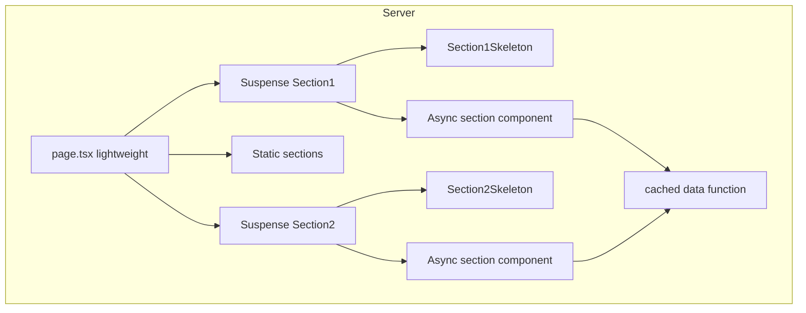

# Next.js Public Pages Optimization Guideline

## Document Version: 1.1
**Creation Date:** February 2026  
**Last Updated:** March 2026  
**Scope:** current stable Next.js (App Router), React, TypeScript

This document defines the **standard approach** for optimizing public pages that have multiple sections and data fetches. It ensures fast first response (TTFB/FCP) without harming SEO by using lightweight route shells, cached shared data, section skeletons, and page metadata. Use this guideline when creating or refactoring any public route.

> [!IMPORTANT]
> App Router streaming with Suspense is production-ready; keep SEO-critical text and metadata server-rendered (`metadata` / `generateMetadata`) instead of relying on client-only hydration.

> [!NOTE]
> Verify implementations against latest official Next.js docs for Loading UI and Streaming.

---

## 1. Overview

Public pages (e.g. homepage, landing pages, service index) often consist of several sections: some fetch data from the database, others are static. If the page waits for all async work before sending HTML, the first byte is delayed and the user sees nothing until the slowest request completes.

**Goal:** Keep the route shell lightweight, maximize static/ISR rendering where possible, and render data sections with clear Suspense boundaries. SEO-critical content must not rely on client-only rendering; streaming may still deliver progressive HTML for below-the-fold sections.

Use this as a generic template for any public page composed of static and async sections.

---

## 2. Key Principles

| Principle | Description |
|-----------|-------------|
| **Lightweight page.tsx** | Page component only composes layout and Suspense wrappers. No heavy `await` in the page root; all data loading happens inside section components. |
| **Suspense per async section** | Every section that performs a DB (or API) fetch may be wrapped in `<Suspense fallback={<SectionSkeleton />}>` for component boundaries, loading UX, and progressive delivery on Vercel. |
| **Deduplicate shared data** | If two or more sections need the same data (e.g. list of services), move the fetch into a single function wrapped with React `cache()` in a lib/data module. Sections call that function and slice/filter as needed; only one request runs per render. |
| **Section skeletons** | Each async section has a dedicated skeleton component that mirrors its layout. The same skeleton is used as the Suspense fallback and in the route's `loading.tsx` so markup is not duplicated. |
| **Metadata per page** | Every public page exports `metadata` (or uses `generateMetadata`) with at least `title`, `description`, and `openGraph` for SEO and social previews. |
| **Optional: dynamic for below-fold client UI** | For interactive below-the-fold components (accordion, tabs, etc.), use `next/dynamic` with `ssr: true` so HTML is still rendered for crawlers while the client bundle can load after first paint. |
| **LCP: hero image priority + optional preload** | For pages where a large hero image is the LCP element, use `priority` and `fetchPriority="high"` on that Image. Optionally add a resource hint via `ReactDOM.preload()` in a small client component so the browser discovers the LCP image earlier (see §5.3). |

---

## 3. Architecture

> [!NOTE]
> Suspense provides both **loading fallbacks** and **streaming-aligned** section boundaries on Vercel; crawlers still need server-rendered or metadata-driven signals for SEO (see table above).



- **Initial render goal:** Lightweight page shell + static sections + skeleton fallbacks where appropriate.
- **Streaming:** Sections may resolve and stream in progressively; do not rely on **order** of streamed chunks for business logic correctness.
- **Crawlers:** SEO-critical content must remain in server-rendered HTML and/or `metadata` (not only client-only).

---

## 4. Checklist for a New Public Page

When adding or refactoring a public page with multiple sections:

1. **Identify async vs static sections** — Which sections call Prisma or fetch? Which are pure static (constants, config)?
2. **Shared data** — If several sections need the same dataset, create a `cache()`-wrapped fetcher in `src/lib/...` or `src/data/...`. Sections call it and derive what they need (e.g. full list for dropdown, `.slice(0, n)` for a grid).
3. **Section skeletons** — For each async section, add a skeleton component (e.g. `SectionSkeleton.tsx`) next to the section; export it from the section's index. Match structure and use `aria-label` for loading state.
4. **page.tsx** — Import only sections and skeletons; export `metadata`. Wrap each async section in `<Suspense fallback={<SectionSkeleton />}><Section /></Suspense>`. Do not wrap static sections.
5. **loading.tsx** — Reuse the same section skeletons (and a minimal CTA/static block if needed) so route-level loading matches in-page fallbacks and markup is not duplicated.
6. **Metadata** — Set `title`, `description`, and `openGraph` (title, description, type: 'website') for the page.
7. **Optional** — For below-the-fold client-only interactivity (e.g. accordion), load the component with `next/dynamic(..., { ssr: true })` so content stays in the initial HTML.
8. **LCP (hero)** — If the page has a large above-the-fold hero image that is the LCP candidate, set `priority` (and `fetchPriority="high"` if the Image atom supports it) on that image. For the main homepage hero, consider adding a preload hint via a client component (see §5.3).

---

## 5. Code Examples

### 5.1 Page structure (metadata + Suspense)

```typescript
// page.tsx — lightweight: no await in root
import type { Metadata } from 'next';
import { Suspense } from 'react';
import { SITE } from '@/config/site';
import { Hero, HeroSkeleton } from '@/components/landing/Hero';
import { ServicesPreview, ServicesPreviewSkeleton } from '@/components/landing/ServicesPreview';

export const metadata: Metadata = {
  title: `Plumbing Services in ${SITE.city} | ${SITE.name}`,
  description: 'Same-day plumbing repairs. Upfront pricing, licensed and insured.',
  openGraph: {
    title: `Plumbing Services in ${SITE.city} | ${SITE.name}`,
    description: 'Same-day plumbing repairs. Upfront pricing, licensed and insured.',
    type: 'website',
  },
};

export default function HomePage() {
  return (
    <>
      <Suspense fallback={<HeroSkeleton />}>
        <Hero />
      </Suspense>
      <Suspense fallback={<ServicesPreviewSkeleton />}>
        <ServicesPreview />
      </Suspense>
    </>
  );
}
```

### 5.2 Cached data module (React cache)

```typescript
// src/lib/homepage-services.ts (or src/data/...)
import { cache } from 'react';
import { prisma } from '@/lib/db/prisma';

export interface HomepageService {
  id: string;
  name: string;
  slug: string;
  shortDescription: string;
  priceFrom: unknown;
  unit: string;
}

const getHomepageServicesCached = cache(async (): Promise<HomepageService[]> => {
  const rows = await prisma.service.findMany({
    where: { active: true },
    orderBy: { order: 'asc' },
    select: {
      id: true,
      name: true,
      slug: true,
      shortDescription: true,
      priceFrom: true,
      unit: true,
    },
  });
  return rows as HomepageService[];
});

export async function getHomepageServices(): Promise<HomepageService[]> {
  return getHomepageServicesCached();
}
```

Sections that need this data call `getHomepageServices()`; the first call runs the query, subsequent calls in the same request reuse the result.

### 5.3 Hero images and LCP (preload)

Public pages with a large hero image often have that image as the **Largest Contentful Paint (LCP)** element. Improving LCP improves Core Web Vitals and Lighthouse performance scores.

**1. Priority and fetch priority on the Image**

- Use the Next.js `Image` component (or the project’s Image atom) with **`priority`** for the LCP image so it is not lazy-loaded and is requested early.
- If the wrapper supports it, set **`fetchPriority="high"`** so the browser prioritizes this request over others. Do **not** combine `priority` with a separate `preload={true}` on the same Image (Next.js docs advise against using preload together with `loading`/`fetchPriority`).

**2. Preload hint for earlier discovery**

The browser discovers the hero image when it parses the `` (or the component that renders it). If layout/CSS or other resources delay that discovery, LCP can suffer. A **`<link rel="preload" as="image" href="...">** in the document head allows the browser to start fetching the image as soon as the head is parsed, before the hero component is rendered.

- Next.js **Metadata API** does **not** support arbitrary `<link rel="preload">` for images. Adding raw `<link>` tags in the root layout’s `<head>` is not the recommended approach in App Router.
- **Recommended approach:** use **`ReactDOM.preload()`** in a small **client component** that runs once (e.g. on mount). This injects the preload link into the document head and is the pattern documented by Next.js for resource hints.

**Steps:**

1. Create a client component (e.g. `HeroImagePreload.tsx`) with `'use client'`.
2. In that component, call `ReactDOM.preload('/path/to/hero-image.jpg', { as: 'image' })` (e.g. in the component body or in a `useEffect`). The component can return `null`; it exists only for the side effect.
3. Mount this component high in the tree (e.g. in the same layout that wraps the page containing the hero)—e.g. in `(public)/layout.tsx` before the main content—so the preload runs on all routes where the hero is critical (e.g. homepage), or only on the route that uses that hero.

**Important:** The preload URL must match what the browser will request. If you use a static path (e.g. `/images/homepage/hero.jpg`), preload that path. If the actual request goes through Next.js Image Optimization (`/_next/image?url=...`), the preload may not match; in that case either preload the same URL that `next/image` will request or rely on `priority` + `fetchPriority="high"` only and document the decision.

Example pattern: use a tiny client component with `ReactDOM.preload()` in layout for LCP candidate images, and set `priority` / `fetchPriority="high"` on the hero image.

**When to use preload**

- **Use:** Single known LCP image (e.g. homepage hero) when lab metrics (Lighthouse/Unlighthouse) show LCP delay and you want to hint the image earlier.
- **Skip or defer:** If `priority` + `fetchPriority="high"` already give good LCP; or if the LCP element is not an image (e.g. text block); or if the image URL is dynamic and preload would not match.

**3. First card in a list (optional LCP)**

On index/grid pages (e.g. list of service cards), the first visible card image may be the LCP element. Give it loading priority so it is not lazy-loaded:

- Add an optional **`priority?: boolean`** prop to the card component and to the image subcomponent; pass it through to the `Image` (e.g. `priority={priority}`).
- On the page, pass **`priority={true}` only for the first item**. Use indices, do not mutate a variable during render (to satisfy React and lint rules). Example: first card of the first category → `priority={categoryIndex === 0 && serviceIndex === 0}`.
- All other cards omit the prop or pass `false`; their images load with default (lazy) behavior.

Example pattern: in grids/lists pass `priority={true}` only for the first above-the-fold card image via index checks.

### 5.4 Section skeleton

Skeleton should match the section layout and include an `aria-label` for accessibility. Minimal shape:

```typescript
// SectionSkeleton.tsx
import { Skeleton } from '@/components/ui/skeleton';
import { Container } from '@/components/atoms/Container';

export const SectionSkeleton = ({ className }: { className?: string }) => (
  <div className={className} aria-label="Loading section">
    <Container>
      <Skeleton className="h-9 w-64 mb-4" />
      <Skeleton className="h-5 w-full" />
      {/* ... match section structure ... */}
    </Container>
  </div>
);
```

**Preload component example (LCP hint):**

```typescript
// HeroImagePreload.tsx — client component, renders nothing
'use client';

import ReactDOM from 'react-dom';

export const HeroImagePreload = () => {
  ReactDOM.preload('/images/homepage/hero-plumber-new.jpg', { as: 'image' });
  return null;
};
```

Mount preload component in layout before main content so preload starts on first paint.

---

## 6. Relation to Other Guidelines

- Apply the same principle consistently: one Suspense boundary per async section, shared skeletons between `loading.tsx` and section fallback, no duplicate fallback for the same content.
- For read-heavy public pages, prefer Server Components and cached fetchers; avoid unnecessary API routes for read-only content.

---

## 7. SEO and Verification

- **Streaming and SEO:** Content is sent in chunks but the final document includes all sections. Crawlers that wait for the full response receive complete HTML.
- **Metadata:** Required for every public page so search results and social shares show correct title and description.
- **Checks:** View page source or use a crawler to confirm full content in HTML; verify `<title>` and Open Graph tags in DevTools or a social preview tool.

---

## 8. AI Assistant Instructions

When creating or refactoring public pages with multiple sections:

1. Follow this guideline: keep the page component light, wrap each async section in its own Suspense with a dedicated section skeleton, and reuse those skeletons in the route's `loading.tsx`.
2. If multiple sections need the same data, introduce a single cached fetcher (React `cache()`) in `src/lib/...` or `src/data/...` and have sections call it.
3. Export `metadata` (or `generateMetadata`) with title, description, and openGraph for the page.
4. Optionally use `next/dynamic` with `ssr: true` for below-the-fold client components (e.g. accordion) to reduce initial JS while keeping content in HTML.
5. **Performance (LCP):** For pages with a large above-the-fold hero image as LCP candidate, set `priority` (and `fetchPriority="high"` where supported). Optionally use `ReactDOM.preload(href, { as: 'image' })` in a tiny client preload component mounted in layout. Do not combine duplicate preload mechanisms on the same image.
6. For list/grid pages, mark only the first above-the-fold image as `priority`; avoid mutable flags during render.

---

## 9. Cross-References

- Next.js: [Loading UI and Streaming](https://nextjs.org/docs/app/building-your-application/routing/loading-ui-and-streaming)
- Next.js Metadata: [https://nextjs.org/docs/app/api-reference/functions/generate-metadata](https://nextjs.org/docs/app/api-reference/functions/generate-metadata)
- Next.js Loading UI and Streaming: [https://nextjs.org/docs/app/building-your-application/routing/loading-ui-and-streaming](https://nextjs.org/docs/app/building-your-application/routing/loading-ui-and-streaming)

---

**Version:** 1.1  
**Last Updated:** March 2026  
**Scope:** reusable guideline for Next.js public pages
