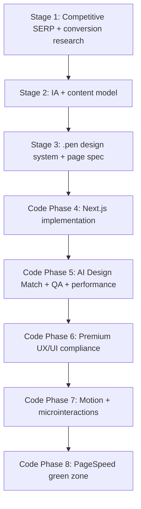

## Purpose
Этот документ агрегирует требования из каталога `@nextjs/nextjs_webinterfaces_creating` и превращает их в единый “System Design / IA overview” для web-интерфейсов premium-качества на базе `Next.js 16+` и `.pen`-макетов.

## Source of truth
- IA + content model: `02-information-architecture-and-content-spec.md`
- `.pen` design system + page spec: `03-pen-design-system-and-page-spec.md`
- Next.js implementation rules (Atomic Design, boundaries, cache, motion policy): `04-nextjs-implementation-spec.md`
- AI Design Match / quality gates / fix-loop: `05-ai-design-match-performance-and-qa.md`
- Premium UX/UI quality bar: `06-premium-pen-and-faang-ux-ui-standards.md`
- Motion + microinteractions guidelines: `07-motion-and-microinteractions-guidelines.md`
- PageSpeed green-zone playbook: `08-pagespeed-green-zone-playbook.md`

## Site structure (route map / sitemap)
Сайт документируется через `route map` (App Router) и роле-ориентированную позицию каждого маршрута в воронке.

Для каждой страницы/маршрута фиксируется:
- URL/slug
- роль в воронке
- primary/secondary intent
- связи с соседними маршрутами
- ожидаемый тип рендеринга (статичный/динамичный/гибрид)

Ключевой invariant: route map согласуется с user flows и KPI (`02-*`).

## User flow
User flow в рамках pipeline описывается как набор сценариев (включая decision points и fallback).

Для ключевых сценариев обязательно:
- входной контекст
- шаги пользователя
- точки выбора (decision points)
- целевое действие (конечный conversion-microstep)
- fallback-путь (что делать в отклонениях/ошибках)

Практика: формулируйте user flow в “действиях пользователя”, а не в описании UI-элементов. Это напрямую влияет на:
- структуру wireframes (`templates/wireframes-mobile-tablet-desktop-template.md`)
- mapping “wireframe region -> .pen regions -> implementation components”

## Architecture (UI + implementation)
Архитектура описывается на двух уровнях: UI-слой и App Router слой.

### UI-layer: Atomic Design + состояние/токены
В `.pen` каждый элемент классифицируется по Atomic Design:
- `atoms`
- `molecules`
- `organisms`
- `templates`
- `pages`

Также закладываются production states:
- `empty/loading/error/forbidden`
- state-машины критичных элементов управления
- обязательные states для controls (input/button/link/menu/modals/toasts)

### App Router слой: server/client boundaries и data/cache/streaming
Рекомендованная policy реализации:
- по умолчанию Server Components
- `use client` добавлять только интерактивным компонентам
- минимизировать shipped JS и выносить интерактивность в небольшие client islands
- data fetching и cache стратегия через `fetch` + cache options:
  - `force-cache` для статичных данных
  - `no-store` для динамичных
  - `next: { revalidate: N }` для TTL
- тегированная инвалидация через `revalidateTag` / `updateTag` (там, где требуется)
- streaming и `Suspense` для асинхронных регионов с явным fallback

### Motion как часть UX
Motion документируется как:
- UX intent (feedback/continuity/emphasis/guidance)
- допустимые свойства (приоритет: `opacity`, `transform`)
- обязательная поддержка `prefers-reduced-motion`
- performance guardrails против long tasks / layout shifts (CLS)

## End-to-end pipeline (from overview to code + gates)

## Acceptance definition (что значит “готово” на уровне overview)
Данный документ считается достаточным “System overview”, если:
- route map и user flow соответствуют `02-*` и достаточно конкретны, чтобы генерировать wireframes
- структура `.pen` и требования к states/tokens соответствуют `03-*` и `06-*`
- правила реализации на Next.js соответствует `04-*` (boundaries/cache/streaming/Atomic Design)
- качество подтверждается quality gates и fix-loop (`05-*`)
- motion и reduced-motion согласованы с `07-*`
- release gate соответствует PageSpeed/CWV порогам (`08-*`)

