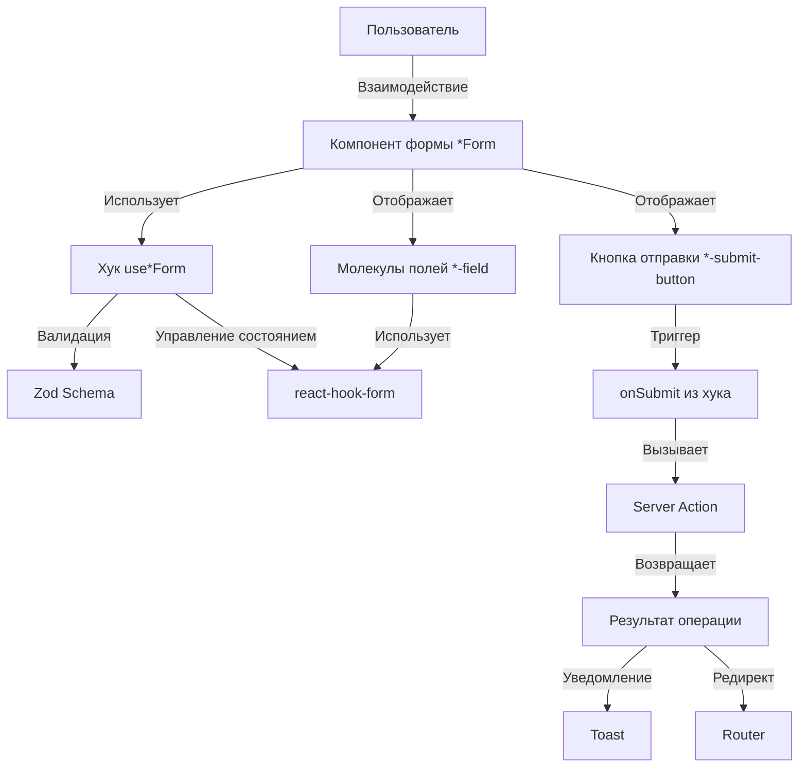

# Паттерн обработки форм для AI Agent

Стандартизированный паттерн создания форм на основе `GradeForm` и `LessonForm`. Обеспечивает единообразие, типобезопасность и удобство поддержки.

## Архитектура

```
Хук формы (use*Form) → Компонент формы (*Form) → Молекулы полей (*-field.tsx) → Кнопка отправки (*-submit-button.tsx)
```

### Поток данных



## 1. Хук формы (use*Form)

Инкапсулирует логику формы: валидацию, состояние загрузки, обработку отправки.

```typescript
import { useForm } from 'react-hook-form';
import { zodResolver } from '@hookform/resolvers/zod';
import { useTransition } from 'react';
import { useRouter } from 'next/navigation';
import { createEntitySchema, updateEntitySchema } from '@/lib/validation/entity';
import { createEntityAction, updateEntityAction } from '@/actions/entity';
import { toast } from 'sonner';

export const useEntityForm = ({ entityId, initialData, onSuccess }: Props) => {
  const [isPending, startTransition] = useTransition();
  const router = useRouter();
  const isEditMode = !!entityId;
  const schema = isEditMode ? updateEntitySchema : createEntitySchema;

  const defaultValues = {
    name: initialData?.name || '',
    ...(isEditMode ? { id: entityId } : {}),
  };

  const form = useForm<CreateEntityInput | UpdateEntityInput>({
    resolver: zodResolver(schema),
    defaultValues,
  });

  const onSubmit = (data: CreateEntityInput | UpdateEntityInput) => {
    startTransition(async () => {
      try {
        const result = isEditMode
          ? await updateEntityAction(data as UpdateEntityInput)
          : await createEntityAction(data as CreateEntityInput);

        if (result.success) {
          toast.success(result.message || 'Операция выполнена успешно');
          onSuccess?.();
          if (result.data) {
            router.push(`/entities/${result.data.id}`);
            router.refresh();
          }
        } else {
          toast.error(result.error || 'Произошла ошибка');
        }
      } catch (error) {
        toast.error(error instanceof Error ? error.message : 'Ошибка');
      }
    });
  };

  return { form, isPending, isEditMode, onSubmit };
};
```

**Ключевые моменты**: `useTransition` для асинхронных операций, условная схема для create/update, типобезопасность через `CreateEntityInput | UpdateEntityInput`, Toast уведомления, автоматические редиректы.

## 2. Компонент формы (*Form)

UI обертка, использующая хук и отображающая поля.

```typescript
'use client';

import { Form } from '@/components/ui/form';
import { useEntityForm } from '@/hooks/useEntityForm';
import { EntityNameField } from '@/components/molecules/entity/entity-name-field';
import { EntitySubmitButton } from '@/components/molecules/entity/entity-submit-button';

export const EntityForm = ({ entityId, initialData, onSuccess }: Props) => {
  const { form, isPending, isEditMode, onSubmit } = useEntityForm({
    entityId,
    initialData,
    onSuccess,
  });

  return (
    <Form {...form}>
      <form onSubmit={form.handleSubmit(onSubmit)} className="w-full space-y-4">
        <EntityNameField control={form.control} disabled={isPending} />
        <EntitySubmitButton
          isPending={isPending}
          isEditMode={isEditMode}
          form={form}
        />
      </form>
    </Form>
  );
};
```

**Особые случаи**: Загрузка начальных данных через `useEffect` в хуке, сложные поля с `FormProvider` для мультиселекторов.

## 3. Молекулы полей (*-field.tsx)

Поля выносятся в отдельные молекулы для переиспользования.

**Простое поле (FormField)**:
```typescript
import { FormControl, FormField, FormItem, FormLabel, FormMessage } from '@/components/ui/form';
import { Input } from '@/components/ui/input';
import type { Control } from 'react-hook-form';

export const EntityNameField = ({ control, disabled }: Props) => (
  <FormField control={control} name="name" render={({ field }) => (
    <FormItem>
      <FormLabel>Название *</FormLabel>
      <FormControl>
        <Input placeholder="Введите название" disabled={disabled} {...field} />
      </FormControl>
      <FormMessage />
    </FormItem>
  )} />
);
```

**Сложное поле (Controller)** для кастомных компонентов:
```typescript
import { Controller } from 'react-hook-form';

export const EntityContentField = ({ control, disabled }: Props) => (
  <Controller control={control} name="content" render={({ field, fieldState }) => (
    <FormItem>
      <FormLabel>Описание</FormLabel>
      <RichTextEditor value={field.value || ''} onChange={field.onChange} 
        className={fieldState.error ? 'border-destructive' : ''} disabled={disabled} />
      <FormMessage />
    </FormItem>
  )} />
);
```

**Поле с FormContext** для мультиселекторов:
```typescript
'use client';
import { useFormContext } from 'react-hook-form';

export const EntitySelector = ({ disabled }: Props) => {
  const { control, watch, setValue } = useFormContext<CreateEntityInput | UpdateEntityInput>();
  return <FormField control={control} name="entityIds" render={() => (
    <FormItem><FormLabel>Выбор элементов *</FormLabel>{/* UI */}<FormMessage /></FormItem>
  )} />;
};
```

**Поле выбора даты** (DatePicker):
```typescript
'use client';
import * as React from 'react';
import { format } from 'date-fns';
import { ru } from 'date-fns/locale';
import { FormControl, FormField, FormItem, FormLabel, FormMessage } from '@/components/ui/form';
import { Button } from '@/components/ui/button';
import { Popover, PopoverContent, PopoverTrigger } from '@/components/ui/popover';
import { Calendar } from '@/components/ui/calendar';
import type { Control } from 'react-hook-form';

export const EntityDateField = ({ control, disabled }: Props) => {
  const [open, setOpen] = React.useState(false);
  return (
    <FormField control={control} name="dateOfBirth" render={({ field }) => (
      <FormItem className="flex flex-col">
        <FormLabel>Дата рождения *</FormLabel>
        <Popover open={open} onOpenChange={setOpen}>
          <PopoverTrigger asChild>
            <FormControl>
              <Button variant="outline" disabled={disabled} className="w-48 justify-between font-normal">
                {field.value ? format(new Date(field.value), 'PPP', { locale: ru }) : 
                  <span className="text-muted-foreground">Выберите дату</span>}
              </Button>
            </FormControl>
          </PopoverTrigger>
          <PopoverContent className="w-auto p-0" align="start">
            <Calendar
              mode="single"
              selected={field.value ? new Date(field.value) : undefined}
              captionLayout="dropdown"
              locale={ru}
              onSelect={(date) => {
                if (date) {
                  field.onChange(format(date, 'yyyy-MM-dd'));
                }
                setOpen(false);
              }}
            />
          </PopoverContent>
        </Popover>
        <FormMessage />
      </FormItem>
    )} />
  );
};
```

**Требования к селектору даты**:
- Использовать `FormField` с `Popover` и `Calendar` из Shadcn UI
- Значение хранить в формате строки `'yyyy-MM-dd'` (ISO date)
- Использовать `date-fns` для форматирования (`format`) и русскую локаль (`ru`)
- Управлять состоянием открытия через `useState` (`open`, `setOpen`)
- При выборе даты: `field.onChange(format(date, 'yyyy-MM-dd'))` и закрывать Popover
- Отображать выбранную дату в формате `'PPP'` (полный формат с локализацией)
- Использовать `captionLayout="dropdown"` для удобного выбора месяца/года

## 4. Кнопка отправки (*-submit-button.tsx)

Отображает состояние загрузки и поддерживает режимы create/edit. **Обязательно включает кнопку "Отменить"** с reset формы и редиректом на предыдущую страницу.

```typescript
'use client';

import { Button } from '@/components/ui/button';
import { Loader2 } from 'lucide-react';
import { useRouter } from 'next/navigation';
import type { UseFormReturn } from 'react-hook-form';

interface EntitySubmitButtonProps {
  isPending: boolean;
  isEditMode: boolean;
  form?: UseFormReturn<any>;
  onCancel?: () => void;
}

export const EntitySubmitButton = ({
  isPending,
  isEditMode,
  form,
  onCancel,
}: EntitySubmitButtonProps) => {
  const router = useRouter();

  const handleCancel = () => {
    // Сброс формы перед редиректом
    if (form) {
      form.reset();
    }
    // Вызов кастомного обработчика или редирект на предыдущую страницу
    if (onCancel) {
      onCancel();
    } else {
      router.back();
    }
  };

  return (
    <div className="flex gap-2 items-center">
      <Button type="submit" disabled={isPending} className="w-auto px-6">
        {isPending ? (
          <>
            <Loader2 className="mr-2 h-4 w-4 animate-spin" />
            {isEditMode ? 'Сохранение...' : 'Создание...'}
          </>
        ) : (
          isEditMode ? 'Сохранить изменения' : 'Создать'
        )}
      </Button>
      <Button
        type="button"
        variant="outline"
        onClick={handleCancel}
        disabled={isPending}
        className="w-auto px-6"
      >
        Отменить
      </Button>
    </div>
  );
};
```

**⚠️ Обязательные требования**:
- **Кнопка "Отменить" обязательна** во всех формах
- Кнопка должна делать `form.reset()` перед редиректом
- Кнопка должна вызывать `router.back()` для возврата на предыдущую страницу
- Кнопка должна быть отключена во время `isPending`
- Компонент должен быть Client Component (`'use client'`)
- Компонент должен принимать `form` как проп для доступа к методу `reset()`
- **Стили кнопок**: 
  - Кнопка submit должна иметь `className="w-auto px-6"` (ширина по содержимому с паддингами)
  - Кнопка "Отменить" должна иметь `className="w-auto px-6"`
  - Контейнер должен иметь `className="flex gap-2 items-center"` для правильного выравнивания
  - **Не использовать** `flex-1` или `w-full` для кнопок submit - они должны быть по ширине содержимого

## 5. Валидация (Zod схемы)

Валидация через Zod схемы в `lib/validation/`:

```typescript
import { z } from 'zod';

export const createEntitySchema = z.object({
  name: z.string().min(1, 'Название обязательно'),
  description: z.string().max(500).optional(),
  // Для полей URL (photo, imageUrl и т.д.) обязательно добавлять .or(z.literal(''))
  // чтобы поддерживать пустые строки без ошибки валидации
  photo: z.string().url('Неверный формат URL фотографии').optional().or(z.literal('')),
});

export const updateEntitySchema = createEntitySchema.extend({
  id: z.string().uuid('Неверный ID'),
});

export type CreateEntityInput = z.infer<typeof createEntitySchema>;
export type UpdateEntityInput = z.infer<typeof updateEntitySchema>;
```

**⚠️ Важно для полей URL**: Если поле может быть пустым (например, `photo`, `imageUrl`), обязательно добавлять `.or(z.literal(''))` после `.optional()`, чтобы пустая строка не вызывала ошибку валидации URL. Пример: `z.string().url('Неверный формат URL').optional().or(z.literal(''))`

## 6. Обработка ошибок

**Валидация**: Ошибки автоматически отображаются через `<FormMessage />`.

**Серверные ошибки**: Обрабатываются в хуке формы через `toast.error(result.error)`.

**Логирование ошибок валидации в консоль** (для отладки в режиме разработки):

В компоненте формы можно добавить обработчики для детального логирования ошибок валидации:

```typescript
'use client';
import type { FieldErrors } from 'react-hook-form';

export const EntityForm = ({ entityId, initialData, onSuccess }: Props) => {
  const { form, isPending, isEditMode, onSubmit } = useEntityForm({
    entityId,
    initialData,
    onSuccess,
  });

  // Wrapper для onSubmit с логированием успешной валидации
  const handleSubmit = (data: EntityFormValues) => {
    console.log('✅ Валидация прошла успешно');
    console.log('📋 Данные формы:', data);
    onSubmit(data);
  };

  // Обработчик ошибок валидации
  const handleSubmitError = (errors: FieldErrors<EntityFormValues>) => {
    console.error('❌ Ошибки валидации формы:');
    console.error('🔴 Объект ошибок:', errors);

    // Детальный вывод ошибок по полям
    Object.keys(errors).forEach((fieldName) => {
      const fieldError = errors[fieldName as keyof EntityFormValues];
      if (fieldError) {
        const fieldValue = form.getValues(fieldName as keyof EntityFormValues);
        console.error(`  📌 Поле "${fieldName}":`, {
          type: fieldError.type,
          message: fieldError.message,
          value: fieldValue,
        });
      }
    });

    // Вывод всех значений формы для отладки
    console.log('📋 Текущие значения формы:', form.getValues());
    console.log('🔍 Состояние формы:', {
      isValid: form.formState.isValid,
      isDirty: form.formState.isDirty,
      isSubmitting: form.formState.isSubmitting,
      errors: form.formState.errors,
    });
  };

  return (
    <Form {...form}>
      <form onSubmit={form.handleSubmit(handleSubmit, handleSubmitError)} className="w-full space-y-4">
        {/* Поля формы */}
      </form>
    </Form>
  );
};
```

**Ключевые моменты**:
- `form.handleSubmit(handleSubmit, handleSubmitError)` - второй параметр это обработчик ошибок валидации
- `handleSubmit` - вызывается при успешной валидации, логирует данные формы
- `handleSubmitError` - вызывается при ошибках валидации, выводит детальную информацию:
  - Объект всех ошибок
  - Детали по каждому полю (тип ошибки, сообщение, текущее значение)
  - Все значения формы
  - Состояние формы (isValid, isDirty, isSubmitting, errors)
- Использовать эмодзи для удобства чтения логов в консоли
- Удалить или закомментировать логирование в production версии

## Чеклист для AI Agent

1. **Zod схемы** (`lib/validation/entity.ts`): 
   - `createEntitySchema`, `updateEntitySchema`, типы `CreateEntityInput`, `UpdateEntityInput`
   - **Для полей URL**: обязательно `.or(z.literal(''))` после `.optional()` для поддержки пустых строк
2. **Server Actions** (`actions/entity.ts`): `createEntityAction`, `updateEntityAction` с валидацией и обработкой ошибок
3. **Хук формы** (`hooks/useEntityForm.ts`): `isEditMode`, `defaultValues`, `useForm` с `zodResolver`, `onSubmit` с `useTransition`, возврат `{ form, isPending, isEditMode, onSubmit }`
4. **Молекулы полей** (`components/molecules/entity/`): `*-field.tsx` для каждого поля, `FormField` для простых, `Controller` для сложных, типизация через `Control<CreateEntityInput | UpdateEntityInput>`, поддержка `disabled`
5. **Кнопка отправки** (`components/molecules/entity/entity-submit-button.tsx`): 
   - **Обязательно**: кнопка "Отменить" с `form.reset()` и `router.back()`
   - Состояние загрузки, режимы create/edit
   - Client Component (`'use client'`)
   - Принимает `form` как проп для доступа к `reset()`
6. **Компонент формы** (`components/*/entity-form.tsx`): 
   - `Form` из Shadcn UI, интеграция с хуком, размещение полей и кнопки
   - **Обязательно**: передача `form={form}` в кнопку отправки
7. **Тестирование**: валидация, создание/обновление, обработка ошибок, редиректы

## Связанные документы

- [AI Component Guidelines](./ai_component_guidelines.md) - общие принципы создания компонентов
- [AI React Hooks Guidelines](./ai_react_hooks_guidelines.md) - принципы создания хуков
- [Architecture](../../architecture/ARCHITECTURE.md) - архитектура проекта

